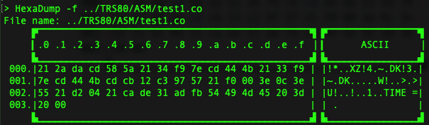

# HexaDump

A small utility – similar to `hexdump` – derived from Arduino code I wrote for my IoT projects. There's absolutely no reason to use this one when `hexdump` works fine, but it doesn't skip lines, and the `-C` option is activated by default.

```sh
> HexaDump -f ../TRS80/ASM/test1.co
File name: ../TRS80/ASM/test1.co
     ▛▔▔▔▔▔▔▔▔▔▔▔▔▔▔▔▔▔▔▔▔▔▔▔▔▔▔▔▔▔▔▔▔▔▔▔▔▔▔▔▔▔▔▔▔▔▔▔▔▜ ▛▔▔▔▔▔▔▔▔▔▔▔▔▔▔▔▔▜
     ▎.0 .1 .2 .3 .4 .5 .6 .7 .8 .9 .a .b .c .d .e .f ▕ ▎      ASCII     ▕
     ▙▁▁▁▁▁▁▁▁▁▁▁▁▁▁▁▁▁▁▁▁▁▁▁▁▁▁▁▁▁▁▁▁▁▁▁▁▁▁▁▁▁▁▁▁▁▁▁▁▟ ▙▁▁▁▁▁▁▁▁▁▁▁▁▁▁▁▁▟
 000.|21 2a da cd 58 5a 21 34 f9 7e cd 44 4b 21 33 f9 | |!*..XZ!4.~.DK!3.|
 001.|7e cd 44 4b cd cb 12 c3 97 57 21 f0 00 3e 0c 3e | |~.DK.....W!..>.>|
 002.|55 21 d2 04 21 ca de 31 ad fb 54 49 4d 45 20 3d | |U!..!..1..TIME =|
 003.|20 00                                           | | .              |
     ▙▁▁▁▁▁▁▁▁▁▁▁▁▁▁▁▁▁▁▁▁▁▁▁▁▁▁▁▁▁▁▁▁▁▁▁▁▁▁▁▁▁▁▁▁▁▁▁▁▟ ▙▁▁▁▁▁▁▁▁▁▁▁▁▁▁▁▁▟
```



差不多啦